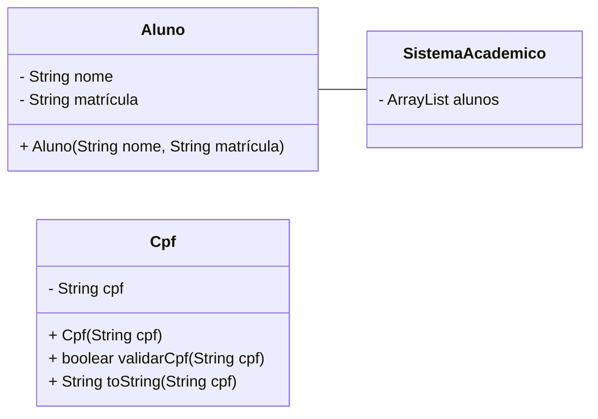

# Diagrama de Classes UML

```mermaid
classDiagram
    direction LR
    class Aluno {
        - String nome
        - String matrícula
        + Aluno(String nome, String matrícula)
    }
    class SistemaAcademico {
        - ArrayList<Aluno> alunos
    }
    class Cpf {
        - String cpf
        + Cpf(String cpf)
        + boolear validarCpf(String cpf)
        + String toString(String cpf)
        
    }
    Aluno -- SistemaAcademico
```