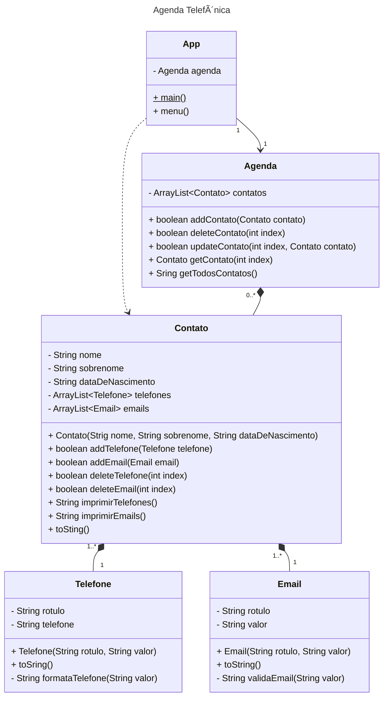

# Diagrama de Classes UML

```mermaid
---
title: Agenda Telefônica
---

classDiagram
    App "1" --> "1" Agenda
    App ..> Contato
    Agenda "0..*" *-- Contato
    Contato "1..*" *-- "1" Telefone
    Contato "1..*" *-- "1" Email
    class App {
        - Agenda agenda
        + main()$
        + menu()
    }
    class Agenda {
        - ArrayList~Contato~ contatos
        + boolean addContato(Contato contato)
        + boolean deleteContato(int index)
        + boolean updateContato(int index, Contato contato)
        + Contato getContato(int index)
        + Sring getTodosContatos()
    }
    class Contato {
        - String nome
        - String sobrenome
        - String dataDeNascimento
        - ArrayList~Telefone~ telefones
        - ArrayList~Email~ emails
        + Contato(Strig nome, String sobrenome, String dataDeNascimento)
        + boolean addTelefone(Telefone telefone)
        + boolean addEmail(Email email)
        + boolean deleteTelefone(int index)
        + boolean deleteEmail(int index)
        + String imprimirTelefones()
        + String imprimirEmails()
        + toSting()
        
    }
    class Telefone {
        - String rotulo
        - String telefone
        + Telefone(String rotulo, String valor)
        + toSring()
        - String formataTelefone(String valor)
    }
    class Email {
        - String rotulo
        - String valor
        + Email(String rotulo, String valor)
        + toString()
        - String validaEmail(String valor)
    }
    
```