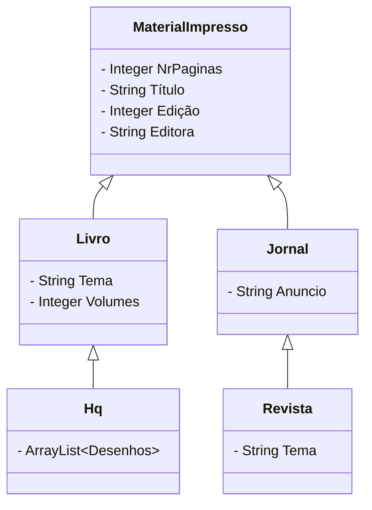

```mermaid
classDiagram
    direction BT
    Hq --|> Livro
    Revista --|> Jornal
    Livro --|> MaterialImpresso
    Jornal --|> MaterialImpresso
    class MaterialImpresso {
        - Integer NrPaginas
        - String Título
        - Integer Edição
        - String Editora
    }
    class Livro {
        - String Tema
        - Integer Volumes
    }
    class Jornal {
        - String Anuncio
    }
    class Revista {
        - String Tema
    }
    class Hq {
        - ArrayList~Desenhos~
    }
```