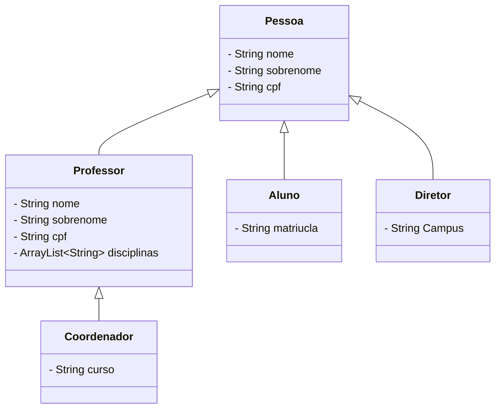

```mermaid
classDiagram
    Professor <|-- Coordenador
    Pessoa <|-- Aluno
    Pessoa <|-- Professor
    Pessoa <|-- Diretor
    class Pessoa {
        - String nome
        - String sobrenome
        - String cpf
    }
    class Aluno {
        - String matriucla
    }
    class Professor {
        - String nome
        - String sobrenome
        - String cpf
        - ArrayList~String~ disciplinas
    }
    class Coordenador {
        - String curso
    }
    class Diretor {
        - String Campus
    }
```