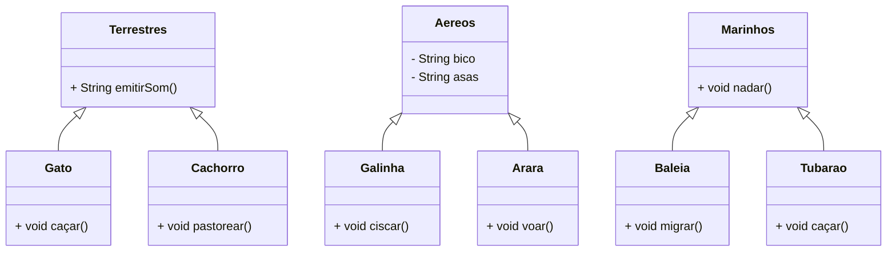

```mermaid
classDiagram
    Terrestres <|-- Gato
    Terrestres <|-- Cachorro
    Aereos <|-- Galinha
    Aereos <|-- Arara
    Marinhos <|-- Baleia
    Marinhos <|-- Tubarao
    
    
    class Terrestres {
        + String emitirSom()
    }
    class Aereos{
        - String bico
        - String asas
    }
    class Marinhos {
        + void nadar()
    }

    class Gato {
        + void caçar()
    }
    class Cachorro {
        + void pastorear()        
    }
    class Arara {
        + void voar()
        
    }
    class Galinha {
        + void ciscar()
    }
    class Baleia {
        + void migrar()
        
    }
    class Tubarao {
        + void caçar()
    }
```