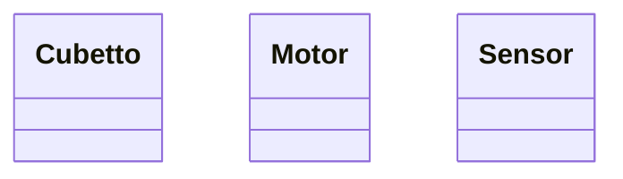

```mermaid

classDiagram
%%    Aviao "1" *-- "1..8" Motor
%%    class Aviao {
%%        - double peso
%%        - int maxTripulantes
%%        - int maxPassageiros
%%        - String modelo
%%        - int anoFab
%%        - ArrayList~Motor~ motores
%%        
%%    }
%%    class Motor {
%%        - String tipo
%%    }
%%    Autor "1..*" --o "0..*" Livro
%%    Editora "1" --o "1..*" Edicao
%%    Edicao "1..*" --* "1" Livro
%%    
%%    class Autor {
%%        - int idAutor
%%        - String nome
%%    }
%%    class Livro {
%%        - int idLivro
%%        - String titulo
%%        - String idioma
%%        - ArrayList~Autor~ autores
%%        - Edicao edicao
%%    }
%%    class Editora {
%%        - int idEditora
%%        - String nome
%%        - String cidade
%%    }
%%    class Edicao {
%%        - String isbn
%%        - int edicao
%%        - int ano
%%        - Editora editora
%%        - int numeroPaginas
%%    }
    %%Cliente "1..*" --o "1" Pedido
    %%Endereco "1" --o "1..*" Cliente
    %%Endereco "1" --o "1" Pedido
    %%ItemPedido "1" --* "1..*" Pedido
    %%Produto "1" --o "1" ItemPedido
    %%
    %%class Produto {
    %%    - String descricao
    %%    - int qtdEstoque
    %% }
    %% class Cliente {
    %%     - String nome
    %%     - String email
    %%     - Arraylist~Enderecos~
    %% }
    %% class Endereco {
    %%     - String rotulo
    %%     - int numero
    %%     - String CEP
    %% }
    %% class ItemPedido {
    %%     - Produto produto
    %%     - int qtd
    %%     - double preco
    %% }
    %% class Pedido {
    %%     - Cliente cliente
    %%     - ArrayList~itemPedido~ produtos
    %%     - LocalDate dataEntrega
    %%     - LocalDate dataPedido
    %%     - Endereço enderecoEntrega
    %%     - String situacao
    %% }
 class Cubetto {
     
 }
 class Motor {
     
 }
 class Sensor{
     
 }

```