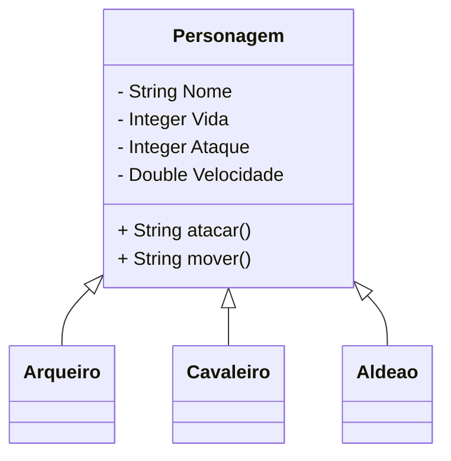

```mermaid
classDiagram
    direction TB
    Personagem <|-- Arqueiro
    Personagem <|-- Cavaleiro
    Personagem <|-- Aldeao
    class Personagem {
        - String Nome
        - Integer Vida
        - Integer Ataque
        - Double Velocidade
        + String atacar()
        + String mover()
    }
    class Arqueiro{
        
    }
    class Cavaleiro {
        
    }
    class Aldeao {
        
    }
```